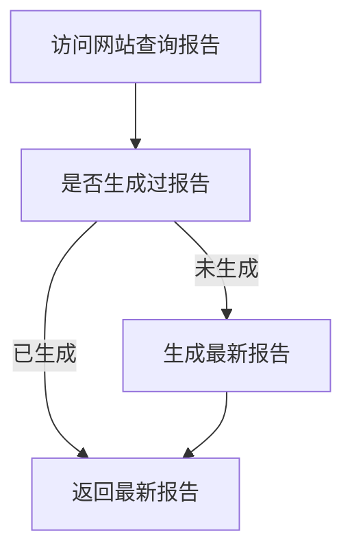
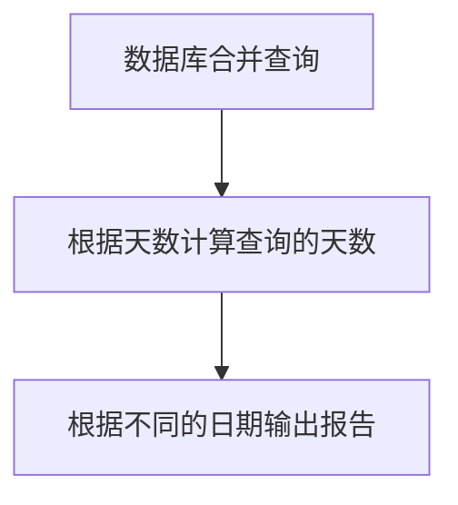

<!-- TOC -->

- [1. 问题](#1-%E9%97%AE%E9%A2%98)
- [2. 思路](#2-%E6%80%9D%E8%B7%AF)
- [3. 解决方案](#3-%E8%A7%A3%E5%86%B3%E6%96%B9%E6%A1%88)
    - [3.1. 需求](#31-%E9%9C%80%E6%B1%82)
    - [3.2. 实现](#32-%E5%AE%9E%E7%8E%B0)
        - [3.2.1. 利用fastapi作为注册的入口，只需要输入内容，或链接地址即可--调研](#321-%E5%88%A9%E7%94%A8fastapi%E4%BD%9C%E4%B8%BA%E6%B3%A8%E5%86%8C%E7%9A%84%E5%85%A5%E5%8F%A3%E5%8F%AA%E9%9C%80%E8%A6%81%E8%BE%93%E5%85%A5%E5%86%85%E5%AE%B9%E6%88%96%E9%93%BE%E6%8E%A5%E5%9C%B0%E5%9D%80%E5%8D%B3%E5%8F%AF--%E8%B0%83%E7%A0%94)
        - [3.2.2. mongodb作为数据库存储--调研](#322-mongodb%E4%BD%9C%E4%B8%BA%E6%95%B0%E6%8D%AE%E5%BA%93%E5%AD%98%E5%82%A8--%E8%B0%83%E7%A0%94)
        - [3.2.3. 定期提醒算法--调研](#323-%E5%AE%9A%E6%9C%9F%E6%8F%90%E9%86%92%E7%AE%97%E6%B3%95--%E8%B0%83%E7%A0%94)
    - [3.3. 测试](#33-%E6%B5%8B%E8%AF%95)
- [4. 结论](#4-%E7%BB%93%E8%AE%BA)
- [5. 展望](#5-%E5%B1%95%E6%9C%9B)
- [6. 文献](#6-%E6%96%87%E7%8C%AE)

<!-- /TOC -->


------------------------------------------------------------------------------

# 1. 问题

* 碎片时间记忆
  现实生活，较多的碎片化时间，为此，希望，利用起这些碎片时间，结合`艾宾浩斯遗忘曲线`理论，将内容定期提醒自己，让自己回顾，以形成记忆


------------------------------------------------------------------------------

# 2. 思路
* 需求
  * 每日阅读文章，将不错的文章注册到个人网站
  * 阅读文章按照一定的周期反馈给自己，让自己复习

* 实现
  * 利用fastapi作为注册的入口，只需要输入内容，或链接地址即可
  * 利用mongodb作为数据库存储
  * 定期提醒算法

* 调研
  * fastapi的基本使用
  * mongodb的基本使用及接口封装
  * 定提醒算法实现，且可以快速验证方案

* 测试
  * 提交内容
  * 定期提醒


------------------------------------------------------------------------------

# 3. 解决方案


## 3.1. 需求
* 每日阅读文章，将不错的文章注册到个人网站：提供一个文本输入框即可
* 阅读文章按照一定的周期反馈给自己，让自己复习：定期钉钉反馈文章链接

## 3.2. 实现

### 3.2.1. 利用fastapi作为注册的入口，只需要输入内容，或链接地址即可--调研
* [fastapi官方文档](https://fastapi.tiangolo.com/)
* fastapi如何和现有框架结合
  * 相当于自己要实现一个简单的wsgi
  * [使用Python来编写HTTP服务器的超级指南](https://www.jb51.net/article/79663.htm)
* 如何提供输入文本框
* 内容如何发送到服务器

### 3.2.2. mongodb作为数据库存储--调研
* 如何安装数据库
  * 菜鸟教程[windows安装](https://www.runoob.com/mongodb/mongodb-window-install.html) [linux安装](https://www.runoob.com/mongodb/mongodb-linux-install.html)

* 什么api可以访问数据库
  * [pymongo](https://api.mongodb.com/python/3.2/index.html#)

* 封装api接口
  ~~~python

  class MongoMgr:
    def Connect(self):
        pass
    def InsertUpdate(self, szCol, dictData):
        pass
    def Query(self, szCol):
        pass
  ~~~

### 3.2.3. 定期提醒算法--调研
* DailyReportMgr
  ~~~python
  class DailyReportMgr:
      def __init__(self):
          self.m_nLastUpdateDay = 0
          self.m_szReport = ""
      def Update(self):
          ```从新计算一遍report```
          # 注意记得更新时间
          pass
      @property
      def Report(self):
          # 检测，如果当天没有生成过，就重新生成
          return self.m_szReport
  ~~~

* 主体流程


* 生成报告算法



* 数据结构
  ~~~yaml
  星星
    title
    body
    createtime
  ~~~

* 需要提醒的天数
  * 1,4,16,64

## 3.3. 测试

* 生成测试数据
  * 循环插入64天的记录，每天一条

* 模拟输入时间
  * 输入时间，返回对应的报告，区分出1天、4天、16天、64天不同情况

* 提交内容
  * 提交一条内容


------------------------------------------------------------------------------

# 4. 结论


------------------------------------------------------------------------------

# 5. 展望


------------------------------------------------------------------------------

# 6. 文献


