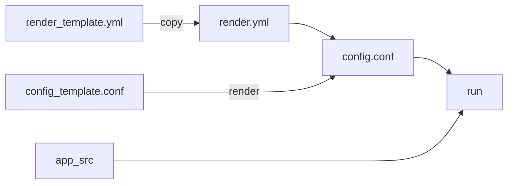

# 1. config.conf

```mermaid
flowchart LR;

render_template.yml--copy-->render.yml-->config.conf
config_template.conf--render--->config.conf
config.conf-->run
app_src---->run
```

* 需要将render_template.yml拷贝一份，并设置其中的变量
* 运行run.bat即可