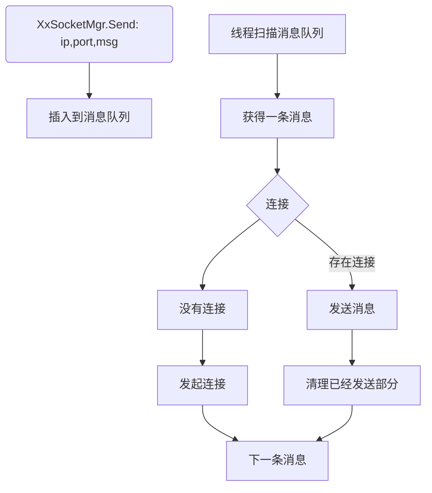

```mermaid
graph TD;

XxSocketMgr.Send(XxSocketMgr.Send: ip,port,msg)
连接{连接}

XxSocketMgr.Send-->插入到消息队列
线程扫描消息队列-->获得一条消息-->连接-->没有连接-->发起连接-->下一条消息
连接--存在连接-->发送消息-->清理已经发送部分-->下一条消息
```

* 消息队列，涉及多线程，需要考虑加锁
* 发起连接，避免同步等待
* 发送信息，避免同步等待
* 如果消息包含的参数，存在文件，文件该如何发送
* 加急消息，应该有一个加急队列