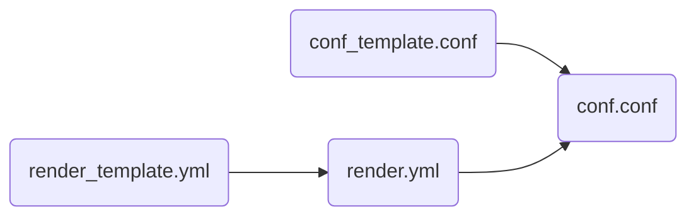

<!-- TOC -->

- [1. 配置文件](#1-%E9%85%8D%E7%BD%AE%E6%96%87%E4%BB%B6)
    - [1.1. rendertemplate.yml](#11-rendertemplateyml)
    - [1.2. conftemplate.conf](#12-conftemplateconf)
    - [1.3. render.yml](#13-renderyml)
    - [1.4. conf.conf](#14-confconf)

<!-- /TOC -->

# 1. 配置文件

* render_template.yml：the template of all variable, include all variable
* render.yml：copy from render_template.yml, you can set value for each variable.
* conf_template.conf：the template of the config, it has variable such as {{CWD}} which will be replace by the value in render.yml.

## 1.1. render_template.yml
the indent is two space.
the tree node name will join to form the real variable name.

for example, it defines variables as follow

~~~
mail:
  user: xx
  password: xx
  type:
    type1: 126
    type2: 163
~~~

* mail_user: xx
* mail_password: xx
* mail_type_type1: 126
* mail_type_type2: 163

we can define the real value in render.yml

~~~
mail:
  user: xiaobao
  password: niubee
  type:
    type1: 126
    type2: 163
~~~

## 1.2. conf_template.conf
it's format is the common config by configparser. it define the section and option name.

for example,

~~~
[mail]
user = {{mail_user}}
password = {{mail_password}}
type1 = {{mail_type_type1}}
~~~

* the varialbe like {{xxx}} format will be replace by value.

## 1.3. render.yml

## 1.4. conf.conf

after render, the output is

~~~
[mail]
user = xiaobao
password = niubee
type1 = 126
~~~

