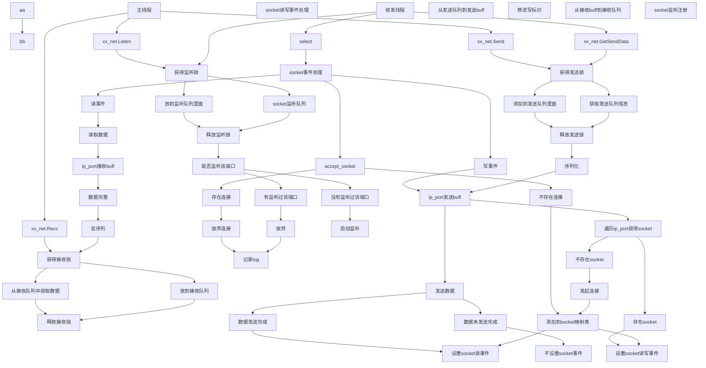

## 流程图 

## 边界

边界1：发送数据时，存在连接或不存在连接
边界2：监听，已经存在监听或不存在监听
边界3：accept socket需要确保是否已经存在连接，避免存在多个1对1连接，最后发送数据，会有问题

边界4：网络断开，可能会导致整个发送异常(可能性比较小，但一旦出现，问题会比较大)

## 类接口设计

~~~
xx_net
    m_queueSendData
    m_queueRecvData
    m_queueListenData

    Listen(ip, port)
    
    Send(ip, port, dictData)
    _RequireAddSendData()
    
    HandleRecv()
    _RequireGetRecvData()-->listDictData(包含ip和端口):需要获得接收锁
    _Handle(listDictData)
    
    GetSendData()
    _RequireGetSendData():需要获得发送锁
    
    AddRecvData():需要获得接收锁
    _RequireAddRecvData()
~~~

~~~
xx_socket_mgr
    m_dictID2Socket
    m_dictIPPort2ID
    
    Run()
    _HandleSocketEvent()
      _Read
      _Write
      _ReadWrite
      _Accept
    _SerializeSendData()
    _UpdateWriteEvent()
    _HandleListen()
~~~