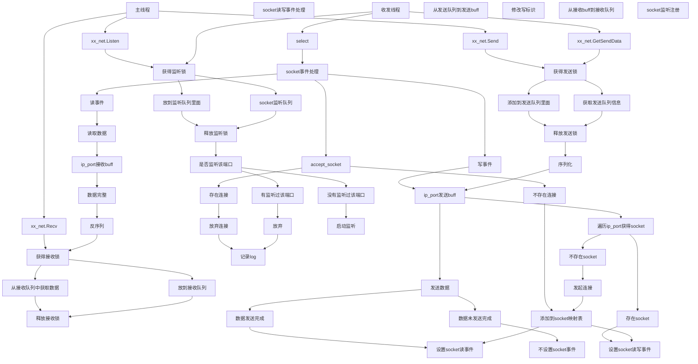
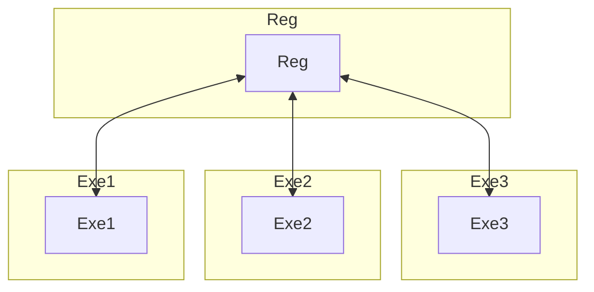
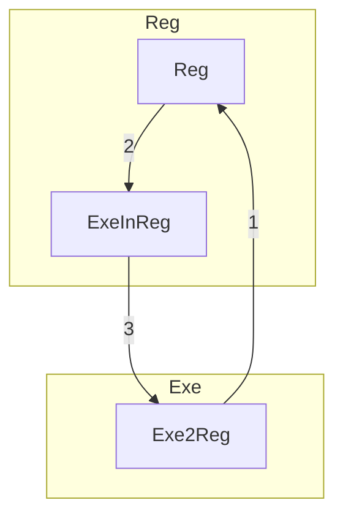
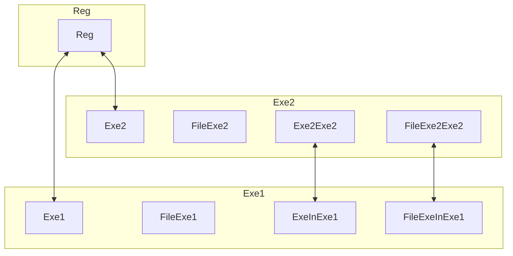
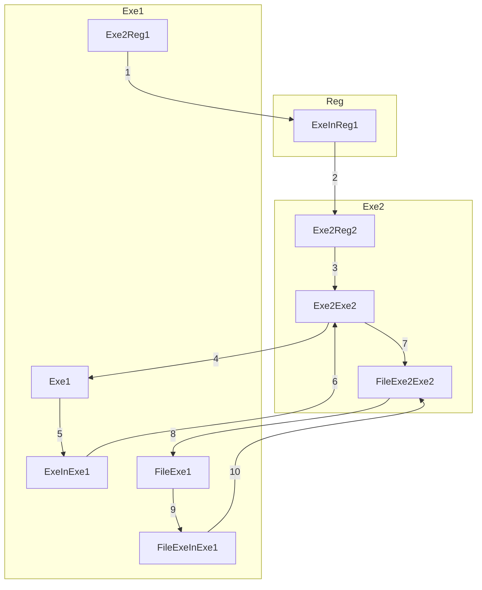
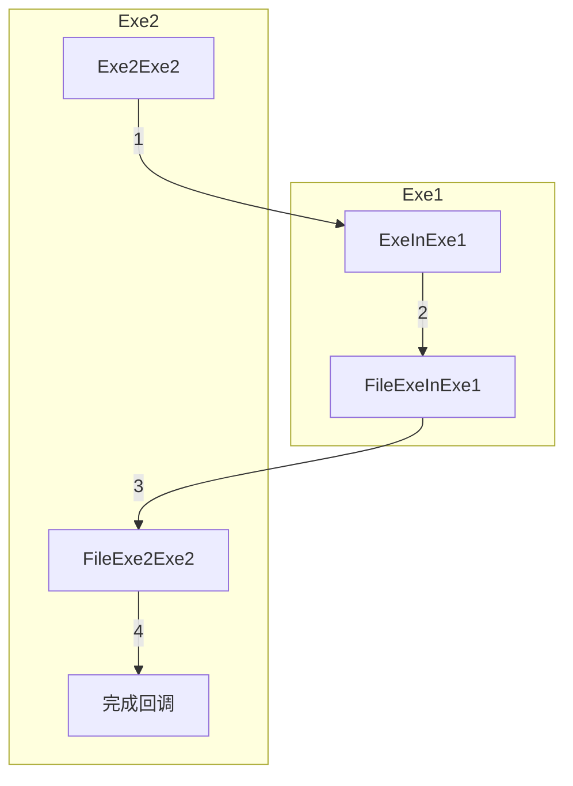

# 1. xx_net

## 1.1. 流程图 



## 1.2. 边界

边界1：发送数据时，存在连接或不存在连接
边界2：监听，已经存在监听或不存在监听
边界3：accept socket需要确保是否已经存在连接，避免存在多个1对1连接，最后发送数据，会有问题

边界4：网络断开，可能会导致整个发送异常(可能性比较小，但一旦出现，问题会比较大)

## 1.3. 类接口设计

~~~
xx_net
    m_queueSendData
    m_queueRecvData
    m_queueListenData

    Listen(ip, port)
    
    Send(ip, port, dictData)
    _RequireAddSendData()
    
    HandleRecv()
    _RequireGetRecvData()-->listDictData(包含ip和端口):需要获得接收锁
    _Handle(listDictData)
    
    GetSendData()
    _RequireGetSendData():需要获得发送锁
    
    AddRecvData():需要获得接收锁
    _RequireAddRecvData()
~~~


~~~
xx_socket_mgr
    m_dictID2Socket
    m_dictIPPort2ID
    
    Run()
    _HandleSocketEvent()
      _Read
      _Write
      _ReadWrite
      _Accept
    _SerializeSendData()
    _UpdateWriteEvent()
    _HandleListen()
~~~

# 2. xx_connection

## 2.1. 需求点
* XxDispatcher：socket封装，进行监听

## 2.2. 流程图

```
nConnectionID = XxConnectionMgr.CreateConnection(type)
    需要提前注册好类型
    根据传入的类型，创建Connection
    Dispatcher：需要创建出socket，并设置好nonblocking

XxConnectionFactory.CreateConnection(type)
    封装一层Factory，更符合工厂模式设计
     
XxConnectionMgr.Listen(nConnectionID， szIp, nPort)
    确定ConnectionID存在，且是可以监听的（通过connection类型来区分）
    Connection存在一个DispatcherID，并调用Listen(nDispatcherID, szIp, nPort)
    Dipsatcher：Listen：参考_HandleListen写法，边界，需要考虑重复监听的报错处理

XxConnectionMgr.Connect(nConnectionID, szTargetIp, nTargetPort)
    Connection:注意检查Connection的状态，每个操作之前，需要确保状态是处于尚未连接状态
    Dispatcher：参考Asyncore，connect需要注意返回值怎么获得？

XxConnectionMgr.Send(nConnectionID, dictData)
    Connection:转发到底层
    BufferDispatcher：将dictData序列化，其中，需要添加报头和数据，并转成二进制
    Dispatcher：调用send接口发送数据，参考asyncore处理异常，根据返回的发送成功大小，更新现有发送BytesIO

XxConnectionMgr.Update()
    定时处理底层的poll

XxConnectionMgr.Close(nConnectionID)
    Connection.Close：根据创建过程，重新初始化变量
    Dispatcher.Close：根据创建过程，重新初始化变量

XxConnectionMgr.Destroy()
    对象自身销毁过程，调用每一个Connection的Destroy

XxDataPack
    headersize | headerdata | data

    Serialize
        先将dictData转成二进制
        再将二进制数据加上报头
    Unserialize
        先读取报头大小
        在读取整个数据长度
        总体解析

    需要简单测试代码，测试接口是否正常

XxDataHeader
    m_nHeaderSize
    m_nDataSize
```


## 2.3. 基本接口
~~~
XxConnection
    m_szTargetIp
    m_nTargetPort
    OnConnect
    OnDisconnect
~~~

~~~
XxConnectionMgr
    m_XxNetObj
    m_dictID2Connection

    XxConnectionMgr()

    CreateConnection(szTargetIp, nTargetPort, dictData)-->nConnectionID
    Listen(szIp, nPort)

    Connect(nConnectionID)

    Send(nConnectionID, dictData)

    Update()

    Close(nConnectionID)

    Destroy()
~~~

## 2.4. 调研
* listen重复监听的报错是啥
* MsgHeader相关代码阅读

## 2.5. 实现

## 2.6. 边界
* 模块测试
  * DataPack序列化和反序列化
* 整合测试
  * 一个客户端：发起连接
               连接成功，发送数据
               接收数据直接关闭

  * 一个服务端：接收请求
               接收数据
               返回数据
               等待对方关闭


# 3. 集群

## 3.1. 图

### 3.1.1. Reg
* 架构图

* 注册流程


* 1 向Reg发起注册
* 2 Reg创建ExeInReg连接
* 3 ExeInReg和Exe2Reg可以正常通信
* Exe2Reg会发送自身的信息给ExeInReg，放到ExecutorMgr中

### 3.1.2. Exe任务图

* 任务架构图


* 任务流程图


* 1、 Exe2Reg1发布任务

* 2、 ExeInReg1分配任务给Exe2Reg2

* 3、Exe2Reg2创建连接Exe2Exe2

* 4、Exe2Exe2连接Exe1

* 5、Exe1创建ExeInExe1

* 6、ExeInExe1和Exe2Exe2形成连接

* 7、Exe2Exe2检查任务需求，需要文件的话，创建FileExe2Exe2

* 8、FileExe2Exe2连接FileExe1

* 9、FileExe1创建FileExeInExe1

* 10、FileExeInExe1和FileExe2Exe2形成连接，FileExe2Exe2获得在FileExeInExe1的ID

* 请求文件流程图


* 1、Exe2Exe2请求文件，包含FileExeInExe1的ID，同时把完成回调ID发送过去。注意，需要考虑超时机制：暂定5分钟。
* 2、ExeInExe1通知FileExeInExe1发送文件，包含回调ID
* 3、FileExeInExe1发送文件
* 4、FileExe2Exe2中接收到数据，并调用传入过来的回调ID